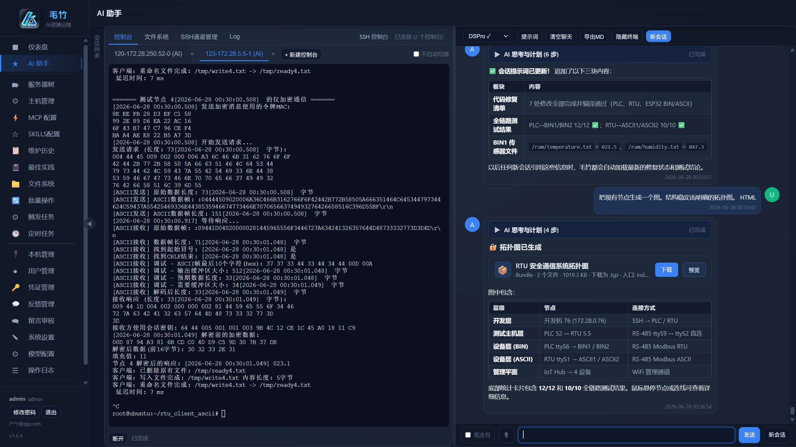
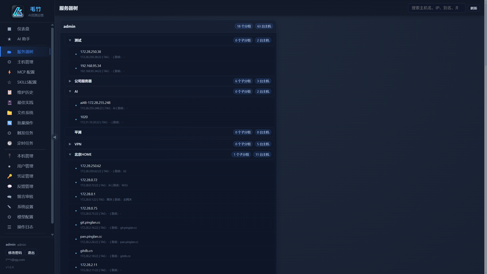
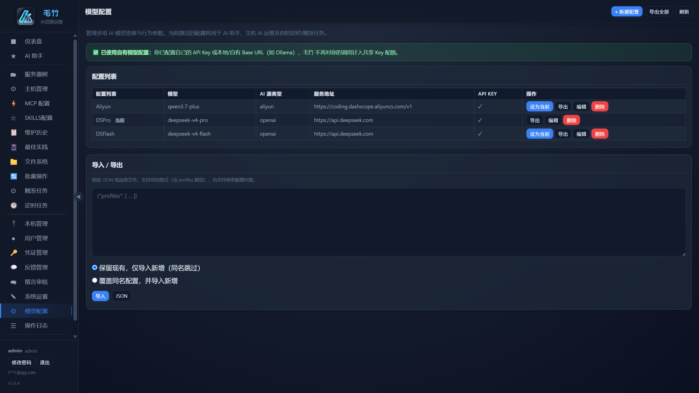
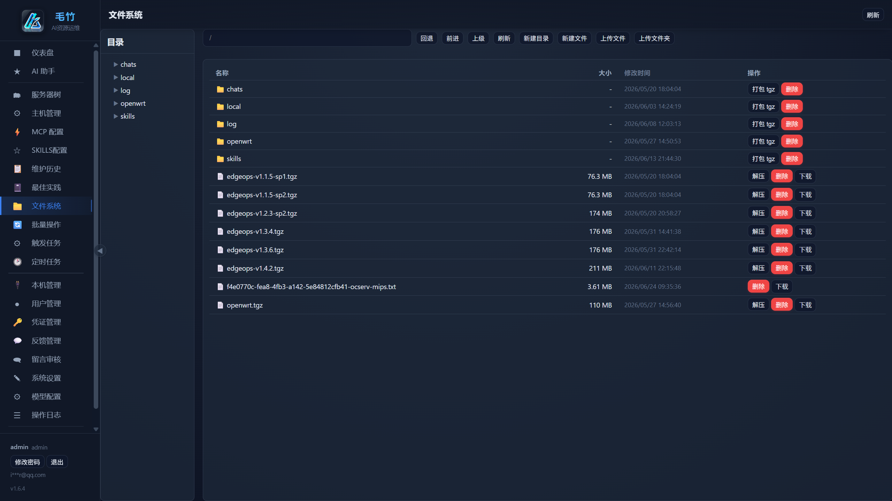
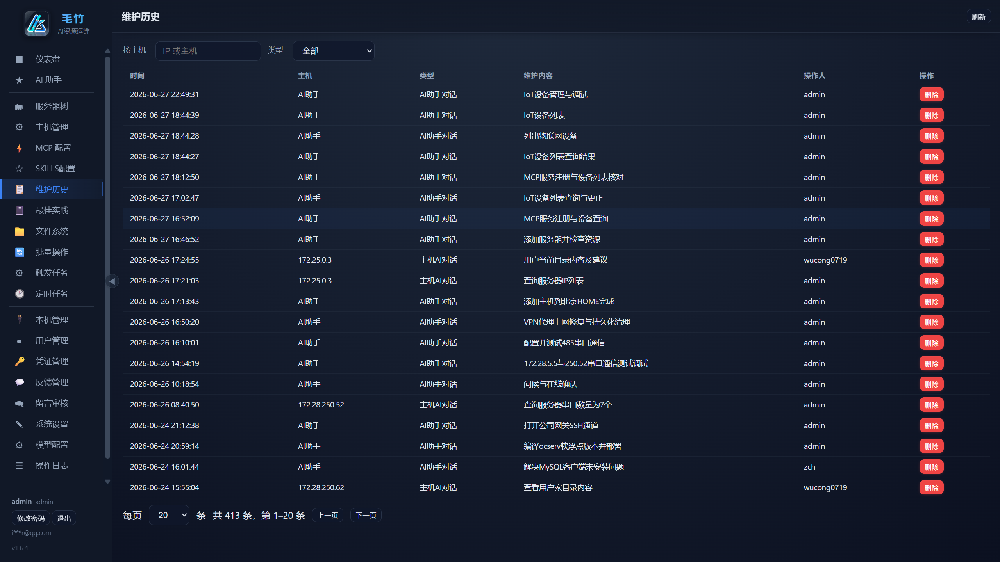
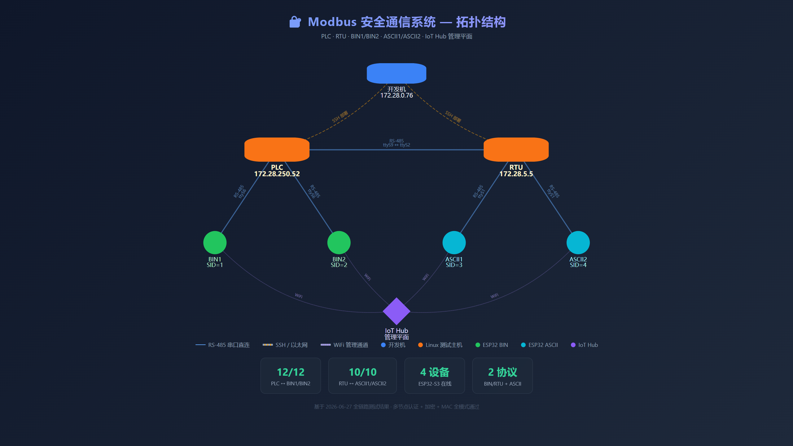
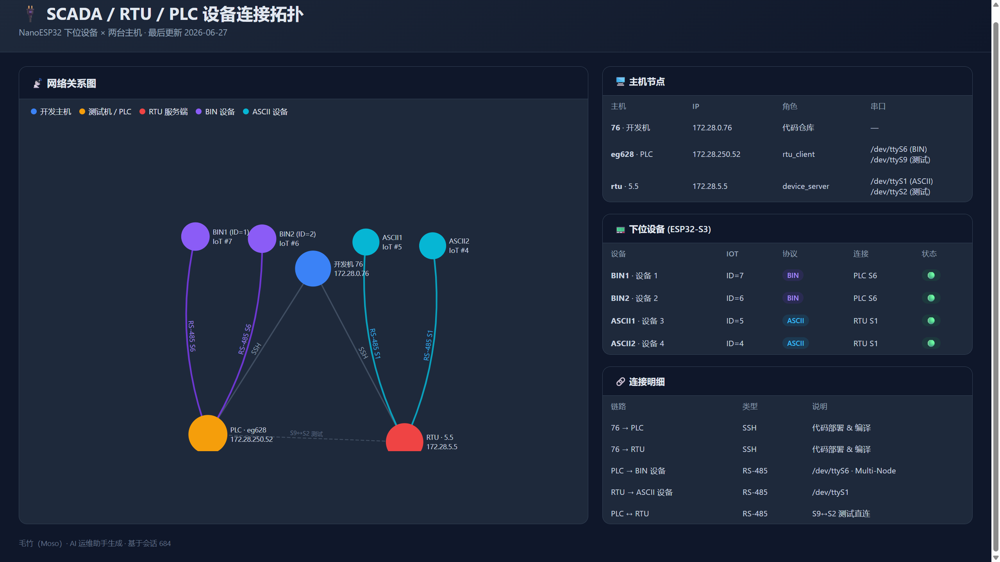

<div align="center">

# 毛竹（Moso）

**面向小团队与个人开发者的 SSH 远程 AI 运维系统**

> 不再向 [Docker Hub](https://hub.docker.com/r/messageloop/moso) 推送新镜像；开源版在未来一段时间内将暂停功能更新。

*主机树 · Web 终端 · AI 助手（Function Calling）· 批量 / 定时任务 · 个人 MCP & Agent Skills · OpenClaw / Hermes 集成*

<br>

[](config.py)
[](#快速开始)
[](#技术栈)
[](#技术栈)
[](requirements.txt)
[](#快速开始)
[](https://hub.docker.com/r/messageloop/moso)

<br>

[English](README.en.md) · **中文** · [Docker Hub `messageloop/moso`](https://hub.docker.com/r/messageloop/moso) · [产品介绍 `/intro/`](http://localhost:8010/intro/) · [功能清单](docs/功能清单.md) · [Docker 部署](docs/Docker部署.md) · [API 文档](docs/API文档.md)

<br>

> **AI 辅助人，不替代人** — 把重复运维交给工具，把精力放在核心业务上。  
> 版本号以 `config.VERSION` 或 `GET /api/version` 为准。

</div>

---

## 毛竹的由来

AI 发展太快，想跟上节奏，却常常感到吃力。这个项目是我用 **Vibe Coding** 边学边做练出来的——既是草稿，也希望它能成为真正有用的软件。决定开源，也是希望它在 AI 浪潮里能占一席之地，而不是被一波波新概念冲散。

它最初叫 **EdgeOps**（边缘运维）：通过 SSH 管理虚拟机、物理机与云主机，分析日志、部署与调试在线业务。

与此同时，AI 的形态几乎每月都在变——聊天、Tool Call、Agent、MCP、Skills、OpenClaw、Hermes……很多中小开发者只有一个人，甚至只能用业余时间做 side project。在巨头林立的行业里，这样的东西还有没有意义？我仍会问自己。

前沿在谈长期运行的智能体，但我相信：**AI 是辅助人，不是替代人**；一个定位清晰的辅助型工具，未必没有价值。思量之后，取名 **毛竹**（Moso）——竹子大江南北都能长，普通，却生生不息；竹鞭在地下延伸，根系相连，所到之处连成一片竹林——就像一台台服务器，织成一张张网络。

## 界面预览

### AI 助手与 Web 终端

主机 AI 运维：左侧 xterm.js 终端与右侧 AI 对话同屏；支持流式 Markdown、Mermaid 拓扑图、工具调用与成果物下载。



### 服务器树

多级分组、标签与主机分享；树内搜索、拖放整理，快速定位目标机器。



### 模型配置

每用户多组 AI Profile（DashScope / OpenAI 兼容 / Ollama 等），可切换当前模型、导入导出 JSON。



### 文件系统

用户私有工作区 `web/fs/<用户名>`：目录树、上传/打包/解压、远程 SFTP 协同。



### 维护历史

按主机 IP、类型筛选；AI 会话标题可自动写入维护记录，便于审计与回溯。



### AI 生成的拓扑图（示例）

会话中让 AI 根据全链路测试结果绘制节点关系图，可导出 HTML / 图片 bundle。



### SCADA / RTU / PLC 连接拓扑看板（示例）

AI 汇总会话上下文，生成交互式 HTML 看板：网络关系图、主机节点、下位设备（ESP32-S3）与连接明细表。



## 功能概览

### 主机、凭证与终端

- **用户与认证**：管理员 / 普通用户、注册、JWT（可滑动续期）、数学验证码、账户锁定与邮件解锁；**修改密码**与管理员重置；**自助注销 / 管理员删除用户**时级联清理关联数据（见 `api/users.py`）。
- **凭证管理**：与主机分离；密码型 / 密钥型；RSA、ECC 一键生成。
- **主机与服务器树**：多级分组、**主机标签**、**主机分享**（提示词与知识按用户隔离）；树内搜索、拖放整理；主机详情 SSH 命令与 **WebSocket 终端**（xterm.js）。
- **维护历史 / 最佳实践**：按主机 IP 或全局知识库；AI 会话取名可自动写入维护记录。

### AI 助手（核心入口）

- **全局 AI 助手**与**主机详情 AI 运维**：多会话、流式 Markdown（Mermaid / Markmap / ECharts）、**可点击选择卡**（确认/多选/危险操作）。
- **每用户 AI 配置**：DashScope / Ollama / OpenAI 兼容接口；上下文长度、系统提示词、自动审批、**图像识别**开关。
- **主机级 / 会话级提示词**、**主机知识库**、**跨主机 `search_hosts_by_prompt`**。
- **聊天附件**（图片、文本、Office/PDF → MarkItDown）与 **AI 成果物**（单文件或 bundle，站内预览/下载）。
- **系统共享 Key 配额**（默认 2000 次；管理员可在**系统设置**调整 `system_ai_usage_limit`，新注册用户按当前配置生效）；用户配置自有 Key 后不计入共享配额。
- **编排**：`delegate_chain`、`delegate_to_edgeops_ai`、**工作流模板**（保存/复用/dry_run）；详见 [AI-Delegation-Cookbook](docs/AI-Delegation-Cookbook.md)。

### 自动化与批量

- **批量操作**：run_command、run_script、scp_push、restart；按分组 / 标签 / 选定主机。
- **触发任务 / 定时任务**：Cron、链式触发、启用开关、运行历史、可选 SMTP 摘要；进程内调度器（约 30 秒 tick）。
- **SSH TTY 通道**：长连接交互式会话，供 AI 与任务使用。

### 集成与扩展

- **内置 MCP**（默认同端口 `/mcp`，`edgeops_*` 工具，含编排类 ops）。
- **每用户 MCP**（`/mcp-servers`）：stdio / SSE / Streamable HTTP；导入导出 Cursor 风格 `mcp.json`；按聊天场景开关。
- **每用户 Agent Skills**（`/skills`）：`web/fs/<user>/skills/` 目录 + 元数据表；扫描、导入导出、渐进式披露（管理员可关）。
- **外部智能体**：OpenClaw（`claw-ops/`）、Hermes（`claw-skills/`）、REST + `eop_` API Token；集成专用聊天通道防长会话压缩。

### 协作、登录页与国际化

- **登录页留言板**（匿名，管理员审核后可选公开展示）与 **系统内用户反馈**（Markdown、管理员回复、未读角标、可选邮件通知）。
- **登录页公开开关**：留言板、公开留言区等（`settings` + `/api/public/login-widgets`）；**无「离线版本申请」**（已移除，升级见迁移 `030`）。
- **界面 i18n**：`web/locales/zh-CN` 与 `en`，16 个模块 JSON；发布前可运行 `python scripts/check_locale_parity.py` 校验键对齐。

### 系统与其它

- **文件系统**：`web/fs/<用户名>` 私有空间；远程 SFTP 浏览与编辑。
- **本机管理**（管理员）：宿主机 shell、进程、文件。
- **API Token**、**个人 SMTP**、**网页/代码搜索**配置、**仪表盘**、**操作日志**（按角色过滤）。
- **系统设置**：全局项（显示语言、站点 SMTP 占位、搜索服务等）；**模型配置**（`/model-config`，每用户多组 AI Profile）；管理员管理用户、邮件模板、**系统共享 Key 试用次数**等。

## 技术栈

| 层 | 技术 |
|----|------|
| 后端 | FastAPI、aiosqlite、Paramiko（SSH/SFTP）、OpenAI 兼容 LLM 客户端 |
| 前端 | 原生 JS SPA（无打包器）、深色主题 CSS、xterm.js、ECharts / Mermaid / Markmap |
| 数据 | SQLite（WAL）、`database/migrations/` 版本化升级（当前 **schema v43**，脚本 **000–042**） |
| 默认端口 | **8010**（与常见 8000 区分） |

## 快速开始

**方式一：本地运行**

```bash
cd Moso
pip install -r requirements.txt
python app.py
```

Windows 可直接双击 **start.bat**；Linux / macOS 可运行 **start.sh**。

**方式二：Docker Hub 镜像（推荐部署）**

官方镜像：[**messageloop/moso**](https://hub.docker.com/r/messageloop/moso)（如 `messageloop/moso:latest` 或带版本标签）。

克隆仓库后，在项目根目录使用自带的 [`docker-compose.yml`](docker-compose.yml)：

```bash
git clone https://github.com/messageloop2025/Moso.git
cd Moso
docker compose pull
docker compose up -d
```

仅拉取镜像、不克隆仓库时：

```bash
docker pull messageloop/moso:latest
```

数据目录 `./data/data`、`./data/fs`、`./data/logs` 会由 compose 自动挂载；更多变量见 [docs/Docker部署.md](docs/Docker部署.md)。

**方式三：本地构建 Docker 镜像**

```bash
docker compose -f docker/docker-compose.yml up -d --build
```

发布镜像到 Hub 见根目录 `publish-docker-hub.bat`。

---

浏览器访问 `http://localhost:8010`，默认管理员：**admin** / **admin123**（首次建库后请尽快修改密码）。

首次使用请在登录后打开侧栏 **「模型配置」**（`/model-config`），填写 Base URL、API Key、模型；可创建多组配置并切换「当前使用」。无有效模型时 AI 助手与任务类能力不可用。

## 数据库：全新安装与升级

| 场景 | 命令 |
|------|------|
| **全新空库**（含默认 admin，schema v43） | `python scripts/bootstrap_fresh_db.py`（已有库加 `--force`） |
| **已有库升级** | `python scripts/migrate_db.py` 或**直接启动应用**（启动时自动迁移） |
| **应用启动策略** | 无库 / 空库 → 完整初始化；已识别 毛竹 库 → 仅跑未执行的迁移；指向含陌生表的 SQLite → **拒绝启动** |
| **重新生成 fresh_install.sql** | 修改 `database/migrations/` 后：`python scripts/regenerate_fresh_install_sql.py` |

离线导入：`sqlite3 edgeops.db < database/bundles/fresh_install.sql`（按运维规范处理目标文件是否为空）。

## 环境变量（常用）

完整列表见 [docs/技术栈说明.md](docs/技术栈说明.md)。

| 变量 | 说明 |
|------|------|
| `EDGEOPS_DB` | SQLite 路径，默认 `edgeops.db` |
| `EDGEOPS_SECRET` | JWT 密钥（生产必改） |
| `EDGEOPS_HOST` / `EDGEOPS_PORT` | 监听，默认 `0.0.0.0:8010` |
| `EDGEOPS_VERSION` | 显示版本号 |
| `EDGEOPS_WORKERS` | 默认 `0` 单进程（推荐）；多 worker 可能重复跑定时任务 |
| `EDGEOPS_SQLITE_BUSY_TIMEOUT_MS` / `EDGEOPS_SQLITE_WAL` | 并发与 WAL |
| `AI_API_KEY` / `AI_BASE_URL` / `AI_MODEL` | 全局 AI 默认 |
| `EDGEOPS_SYSTEM_AI_USAGE_LIMIT` | 共享 Key 每用户次数上限（**首次安装默认**）；运行中可在系统设置 `system_ai_usage_limit` 覆盖，默认 **2000** |
| `EDGEOPS_AGENT_MAX_STEPS` / `EDGEOPS_ASSISTANT_MAX_ROUNDS` | Agent 步数上限 |
| `EDGEOPS_AI_CONTEXT_SIZE` | 聊天上下文字符上限，0=不限制 |
| `EDGEOPS_MCP_ENABLED` / `EDGEOPS_MCP_HTTP_PATH` | 内置 MCP，默认开启、路径 `/mcp` |
| `EDGEOPS_USER_SKILLS_*` | 个人 Skills 渐进披露与体积上限 |
| `EDGEOPS_TRUST_PROXY_HEADERS` / `EDGEOPS_TRUSTED_PROXY_HOSTS` | 反代 HTTPS（Docker/nginx 常用） |

## 开发与发布前检查

```bash
# 中英文 locale 键一致
python scripts/check_locale_parity.py

# 仅升级数据库（不启动 Web）
python scripts/migrate_db.py
```

## 后续可扩展

- 密钥加密存储、更多 LLM 提供商适配、按角色更细的 Skills 白名单。
- 聊天 tool 调用与结果分表存储，便于审计与检索。
- 多实例部署下的定时任务去重与数据库换 PostgreSQL 等（见 [并发与扩展](docs/并发与扩展.md)）。

更多建议见 [docs/开发与完善建议.md](docs/开发与完善建议.md)。
